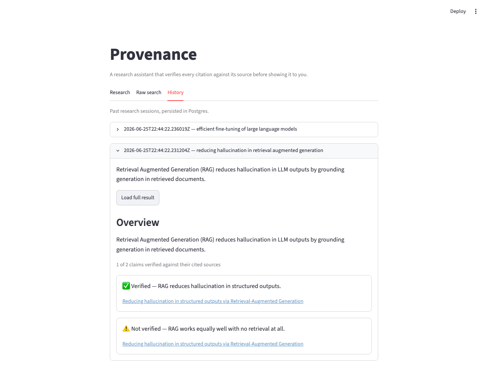

# Provenance

[](https://github.com/kartik117/Provenance/actions/workflows/ci.yml)

A multi-agent research assistant that searches academic papers, filters them for relevance, synthesizes a summary, and verifies every claim against its cited source before showing it to you.

Most LLM research tools will cite a paper that doesn't actually say what they claim it says. Provenance runs a dedicated verification step over every citation, so the output is grounded in sources that were actually checked — and flags the ones that aren't.



## How it works

```
query
  -> Search Agent          (ArXiv + Semantic Scholar)
  -> Filter Agent           (relevance scoring, dedup)
  -> Synthesis Agent        (LangGraph, summarizes findings)
  -> Citation Verification  (checks claim <-> paper alignment)
  -> grounded summary with verified citations
```

All four agents are wired into a single LangGraph `StateGraph` (`src/provenance/pipeline.py`), exposed via FastAPI's `/research` endpoint and rendered in a Streamlit UI that shows a verified/unverified badge on every claim.

## Stack

LangGraph · FastAPI · Streamlit · Gemini · PostgreSQL · RAGAS · Docker

## Running it

**Docker (recommended — runs Postgres, the API, and the UI together):**

```bash
cp .env.example .env   # add your GOOGLE_API_KEY
docker compose up --build
```

API on `localhost:8000`, UI on `localhost:8501`.

**Without Docker:**

```bash
python3.11 -m venv .venv
source .venv/bin/activate
pip install -e ".[dev]"
cp .env.example .env   # add your GOOGLE_API_KEY
uvicorn provenance.api.main:app --port 8000 &
streamlit run app/streamlit_app.py
```

Needs a running Postgres matching `DATABASE_URL` in `.env` (e.g. `brew services start postgresql@16` and create the `provenance` role/db) — if it's not reachable, `/research` still works, it just skips persistence.

Either way, open the **Research** tab and ask a question like "reducing hallucination in retrieval augmented generation." Every call is saved to Postgres and browsable in the **History** tab.

Note: Gemini's free tier caps each model at **20 requests/day**, and `/research` costs 3 calls (filter, synthesize, verify) per query — so expect roughly 6 free queries/day on a given model before it 429s.

## Testing

```bash
pip install -e ".[dev]"
pytest         # unit tests, all mocked — no live API calls, no Postgres needed
ruff check .
```

## Evaluation

`eval/run_eval.py` runs the full pipeline over a small set of representative queries and scores each result with RAGAS **faithfulness** (does the synthesized overview actually follow from the retrieved abstracts?) and **context precision** (were the retrieved papers relevant?).

```bash
pip install -e ".[eval]"
python -m eval.run_eval
```

Results are written to `eval/results.json` (gitignored — it's a generated, point-in-time run, not a static benchmark). The query set is intentionally small (3 queries) because each one costs ~6 LLM calls between the pipeline and RAGAS's own scoring, and the free tier's 20-requests/day cap is shared with everything else hitting that model that day.

On the one query that completed before hitting that limit during development, faithfulness scored **0.92** — consistent with the pipeline's design (synthesis is grounded only in retrieved abstracts, and citation verification catches claims that overreach).

## Engineering notes

A few real problems that came up building this, since "it just worked" would be a lie:

- **Gemini's free tier is 20 requests/day per model, not a per-minute throttle.** Found this empirically after burning through it during testing. `gemini-2.0-flash` turned out to have zero free quota at all despite being in the docs; `gemini-2.5-flash` and `gemini-2.5-flash-lite` both work, each with their own separate 20/day budget. Defaulted to flash-lite so a live demo has more headroom.
- **The citation verification agent actually rejects claims.** In one real run, the synthesis agent produced 4 claims from the retrieved abstracts — verification caught 2 of them as unsupported overreach. That's the entire point of the project working as designed, not a polished-up success case.
- **`ragas` 0.4.x hard-imports a `langchain_community` submodule that's been removed upstream.** Rather than downgrading core langchain packages and risking the working pipeline, `eval/_ragas_compat.py` stubs out just that one import — documented inline with why.
- **Each external dependency degrades independently.** If Semantic Scholar rate-limits, search still returns ArXiv results. If Postgres is unreachable, `/research` still returns a result, it just skips saving it. Nothing upstream of a failure should go down with it.
- **Chroma was in the original spec; it isn't in the code.** The pipeline does live API search and LLM-based relevance scoring, not retrieval over an embedded corpus — there was no real use for a vector store, so it got cut instead of bolted on for the sake of the stack list.

## License

MIT
